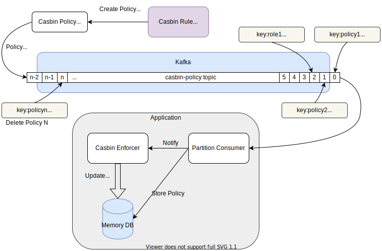

# Casbin Kafka Watcher

[Casbin](https://github.com/casbin/casbin) watcher for kafka

> This watcher library will enable users to dynamically change
> casbin policies through kakfa messages

Influenced by https://github.com/rusenask/casbin-go-cloud-watcher

### Installation

```shell
go get -u github.com/wgarunap/casbin-kafka-watcher
```
### Architecture


### Usage

Configuration can be passed from the application without any strict env variable. To Initialize the watcher, user need
to parse
`kafka brokers` array , `topic name` and `callback function`.

On each restart all the messages in the kafka topic will be synced to application policy and latest state will build on
the application.

User can keep the kafka message `key`,`value` and `headers` with preferred encoding such as `[]byte`, `string`, `json`
,`avro`, `protobuf` or etc.

Message decoding logic and loading the policy into enforcer can be done inside the callback function. The logic has to
write manually by the user.

Example:

Sample Kafka Messages to Produce

```shell
Message1
    Key:policy1
    Value:p, alice, data1, read
    
Message2
    Key:role1
    Value:g,alice,admin

Message3
    Key:policy2
    Value:p, admin, data2, read
```

Sample Kafka Messages to Delete Policies - Produce Null values for the same policy key
```shell
Message4
    Key:policy1
    Value:
Message4
    Key:role1
    Value:
```

Code:
```go
package main

import (
	"context"
	"fmt"
	"github.com/casbin/casbin/v2"
	"github.com/casbin/casbin/v2/model"
	"github.com/tryfix/kstream/data"
	"github.com/tryfix/log"
	"github.com/wgarunap/casbin-kafka-watcher"
	"github.com/wgarunap/casbin-kafka-watcher/adaptor"
	"strings"
	"time"
)

var modelStr = `
[request_definition]
r = sub, obj, act

[policy_definition]
p = sub, obj, act

[role_definition]
g = _, _

[policy_effect]
e = some(where (p.eft == allow))

[matchers]
m = g(r.sub, p.sub) && r.obj == p.obj && r.act == p.act
`

func main() {
	ctx := context.Background()
	brokers := []string{"localhost:9092"}
	topic := `casbin-policy-updates`
	log.StdLogger = log.StdLogger.NewLog(log.WithLevel(log.DEBUG), log.WithColors(false))

	enforcer, err := casbin.NewSyncedEnforcer()
	if err != nil {
		log.Fatal(err)
	}

	//// StartAutoLoadPolicy load policies from adaptor in the given interval
	//enforcer.StartAutoLoadPolicy(10 * time.Second)

	mdl, err := model.NewModelFromString(modelStr)
	if err != nil {
		log.Fatal(err)
	}

	memAdaptor := adaptor.NewAdapter()

	err = enforcer.InitWithModelAndAdapter(mdl, memAdaptor)
	if err != nil {
		log.Fatal(err)
	}

	cfg := watcher.NewConfig(topic, brokers,
		func(record *data.Record) error {
			// Here you will receive kakfa message data
			fmt.Println(record.Offset, `key:`, string(record.Key), `value:`, string(record.Value), `length:`, len(record.Value))

			if len(record.Value) == 0 {
				// enforcer.RemovePolicy() cannot be used since it only allows p type policies
				_ = memAdaptor.RemovePolicy(string(record.Key), "", nil)
			} else {
				policies := strings.Split(string(record.Value), ",")
				if len(policies) > 2 {
					// enforcer.AddPolicy()  cannot be used since it only allows p type policies
					_ = memAdaptor.AddPolicy(string(record.Key), policies[0], policies[1:])
				} else {
					return fmt.Errorf(`policy length should be greater than 2`)
				}
			}

			// this will load policies immediately after it receive new change
			err := enforcer.LoadPolicy()
			if err != nil {
				return err
			}

			return nil
		})
	cfg.SetLogger(
		log.NewLog(
			log.FileDepth(2),
			log.WithLevel(log.INFO),
			log.WithColors(false),
			log.Prefixed(`casbin-consumer`),
		).Log(),
	)

	_, err = watcher.New(ctx, cfg)
	if err != nil {
		log.Fatal(err)
	}

	enforcer.EnableLog(true)

	fmt.Println(`starting debug loop`)
	for {
		select {
		case <-time.NewTicker(3 * time.Second).C:
			sub, obj, act := `alice`, `data2`, `read`
			if ok, err := enforcer.Enforce(sub, obj, act); ok {
				log.Info(`if block inside`)
			} else {
				if err != nil {
					log.Error(err.Error())
				}
				log.Info(`else block inside`)
			}
		}
	}
}

```

### Suggested Kafka Topic Configuration

Compact the data for a same key and keep the latest message, enabling log compaction. This config will keep the topic
data without deleting.

```shell
log.cleanup.policy = compact
```

If you are sending whole casbin policy in a single kafka message, remember to set the `max.message.bytes` config in
Kafka. It's default value is `1MB`

Keep the kafka topic partition count as 1. Otherwise, parallel updates through partitions will result in incorrect final
policy state. While making this library It is assumed there is only 1 partition for the policy topic. It will only
consume from `0`th partition.

If you are running kafka as a cluster keep the replica count as 3 or more.

### Contact

Aruna Prabhashwara\
wg.aruna.p@gmail.com
